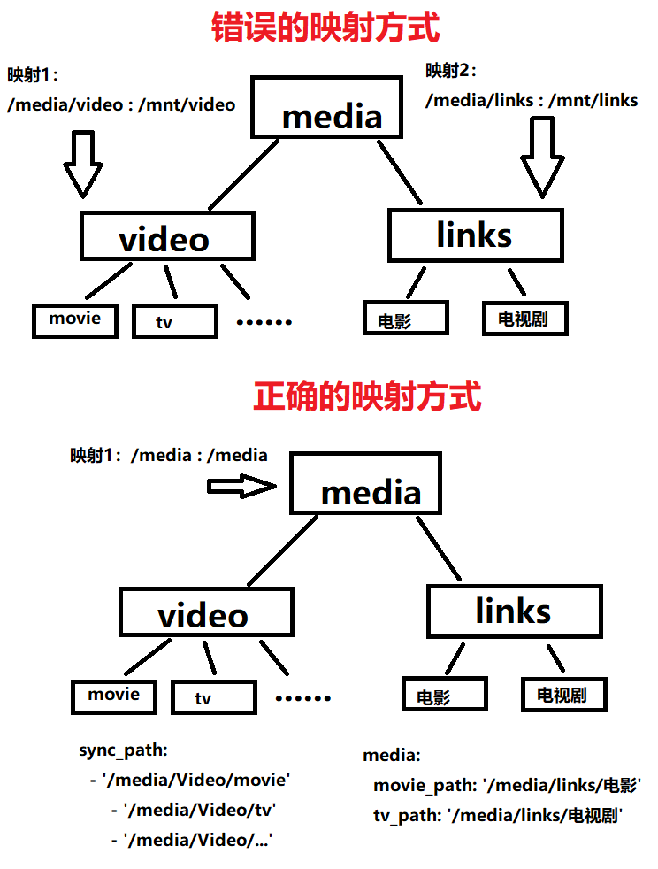

## 特点

- 基于alpine实现，镜像体积小；

- 镜像层数少；

- 支持 amd64/arm64 架构；

- 重启即可更新程序，如果依赖有变化，会自动尝试重新安装依赖，若依赖自动安装不成功，会提示更新镜像；

- 可以以非root用户执行任务，降低程序权限和潜在风险；

- 可以设置文件掩码权限umask。

- lite 版本不包含浏览器内核及xvfb，不支持浏览器仿真；不支持Rclone/Minio转移方式；不支持复杂依赖变更时的自动安装升级；但是体积更小。

## 创建

**注意**

- 媒体目录的设置必须符合 [配置说明](https://github.com/120318/nas-tools#%E9%85%8D%E7%BD%AE) 的要求。

- umask含义详见：http://www.01happy.com/linux-umask-analyze 。

- 创建后请根据 [配置说明](https://github.com/120318/nas-tools#%E9%85%8D%E7%BD%AE) 及该文件本身的注释，修改`config/config.yaml`，修改好后再重启容器，最后访问`http://<ip>:<web_port>`。

**docker cli**

```
docker run -d \
    --name nas-tools \
    --hostname nas-tools \
    -p 3000:3000   `# 默认的webui控制端口` \
    -v $(pwd)/config:/config  `# 冒号左边请修改为你想在主机上保存配置文件的路径` \
    -v /你的媒体目录:/你想设置的容器内能见到的目录    `# 媒体目录，多个目录需要分别映射进来` \
    -e PUID=0     `# 想切换为哪个用户来运行程序，该用户的uid，详见下方说明` \
    -e PGID=0     `# 想切换为哪个用户来运行程序，该用户的gid，详见下方说明` \
    -e UMASK=000  `# 掩码权限，默认000，可以考虑设置为022` \
    -e NASTOOL_AUTO_UPDATE=false `# 如需在启动容器时自动升级程程序请设置为true` \
    -e NASTOOL_CN_UPDATE=false `# 如果开启了容器启动自动升级程序，并且网络不太友好时，可以设置为true，会使用国内源进行软件更新` \
    jxxghp/nas-tools
```

如果你访问github的网络不太好，可以考虑在创建容器时增加设置一个环境变量`-e REPO_URL="https://ghproxy.com/https://github.com/120318/nas-tools.git" \`。

**docker-compose**

新建`docker-compose.yaml`文件如下，并以命令`docker-compose up -d`启动。

```
version: "3"
services:
  nas-tools:
    image: jxxghp/nas-tools:latest
    ports:
      - 3000:3000        # 默认的webui控制端口
    volumes:
      - ./config:/config   # 冒号左边请修改为你想保存配置的路径
      - /你的媒体目录:/你想设置的容器内能见到的目录   # 媒体目录，多个目录需要分别映射进来，需要满足配置文件说明中的要求
    environment: 
      - PUID=0    # 想切换为哪个用户来运行程序，该用户的uid
      - PGID=0    # 想切换为哪个用户来运行程序，该用户的gid
      - UMASK=000 # 掩码权限，默认000，可以考虑设置为022
      - NASTOOL_AUTO_UPDATE=false  # 如需在启动容器时自动升级程程序请设置为true
      - NASTOOL_CN_UPDATE=false # 如果开启了容器启动自动升级程序，并且网络不太友好时，可以设置为true，会使用国内源进行软件更新
     #- REPO_URL=https://ghproxy.com/https://github.com/120318/nas-tools.git  # 当你访问github网络很差时，可以考虑解释本行注释
    restart: always
    network_mode: bridge
    hostname: nas-tools
    container_name: nas-tools
```

## 后续如何更新

- 正常情况下，如果设置了`NASTOOL_AUTO_UPDATE=true`，重启容器即可自动更新nas-tools程序。

- 设置了`NASTOOL_AUTO_UPDATE=true`时，如果启动时的日志提醒你 "更新失败，继续使用旧的程序来启动..."，请再重启一次，如果一直都报此错误，请改善你的网络。

- 设置了`NASTOOL_AUTO_UPDATE=true`时，如果启动时的日志提醒你 "无法安装依赖，请更新镜像..."，则需要删除旧容器，删除旧镜像，重新pull镜像，再重新创建容器。

## 关于PUID/PGID的说明

- 如在使用诸如emby、jellyfin、plex、qbittorrent、transmission、deluge、jackett、sonarr、radarr等等的docker镜像，请保证创建本容器时的PUID/PGID和它们一样。

- 在docker宿主上，登陆媒体文件所有者的这个用户，然后分别输入`id -u`和`id -g`可获取到uid和gid，分别设置为PUID和PGID即可。

- `PUID=0` `PGID=0`指root用户，它拥有最高权限，若你的媒体文件的所有者不是root，不建议设置为`PUID=0` `PGID=0`。

## 如果要硬连接如何映射

参考下图，由imogel@telegram制作。


